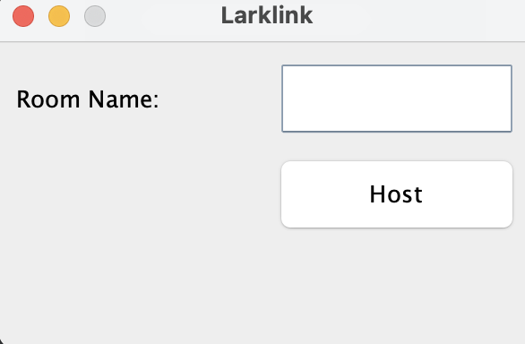
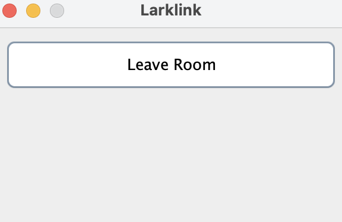

# LarkLink
## Introduction
LarkLink is a chat system that allows you to host a room or join existing rooms to chat with other users.
Once inside the room, you can send and receive normal messages or if you'd like to annoy your friends you can send a _lark_!
## Overview
### Main
Running LarkLink is as simple as navigating to our `Main` class under `src/main/java` and running the `main` method.
It allows you to initialize and start LarkLink. 
(Screenshot of main screen)  
First you'll be prompted to either create an account or sign in to an existing one.
### Signup and Login
If you don't have an account for LarkLink yet, you need to register first. To register, LarkLink requires you to enter
username and password. 
 
LarkLink allows alphanumeric characters for username and password. Username must be at least 3 characters long and
must not overlap with existing usernames. Password must be at least 8 characters long. 
If you try to set username and password shorter than each minimum length, you will see an error message.
If you enter valid username and password, you're all set! You'll be allowed to either Join or Host a chat room.
### Join a Room
A user can join a room by the room id. If the room id exists, the user can join in successfully. The user will be added to the list of active users. The list of active users of that room will be updated.
### Host a Room
A user can host a group chat in the program using the Host Room feature.
The user is asked to input a unique room ID when a user hosts a room, and it will then store the user's ID as the room's host. One user can only host a room. Once the host leave the room, the room will dissapear.
 
 
### Send Messages (and _lark_)
Users can send messages when they are inside the room. Users can also choose to send the lark.
### Leave a Room
Users can leave the groupchat by using the Leave Room feature. The user will be removed from the list of active users in a room when they decide to leave it and the list of active users of that room will be updated. The user can only exit a room if they are on the list of users who are actively using it right now. An error message will appear if the user is not present in that room.
 
 
## Design Patterns
TODO - Mention View Builder Pattern and ??? 

## Test Coverage
TODO - Aim for 100% and justify what we miss

## Java Doc
TODO

## Packaging
TODO - short explanation that it's by use case unless it's low level ?
