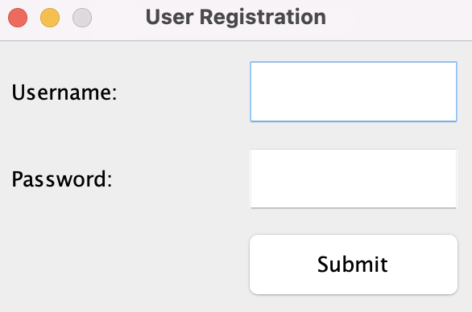
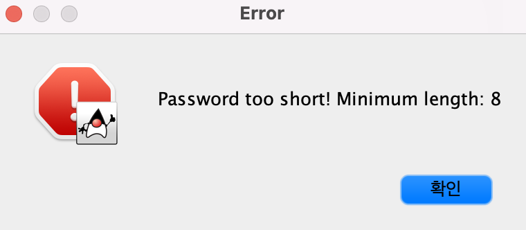

# LarkLink
## Introduction
LarkLink is a chat system that allows you to host a room or join existing rooms to chat with other users.
Once inside the room, you can send and receive normal messages or if you'd like to annoy your friends you can send a _lark_!
## Overview
### Main
Running LarkLink is as simple as navigating to our `Main` class under `src/main/java` and running the `main` method.
It allows you to initialize and start LarkLink. 
(Screenshot of main screen)  
First you'll be prompted to either create an account or sign in to an existing one.
### Signup and Login
If you don't have an account for LarkLink yet, you need to register first. To register, LarkLink requires you to type
username and password. LarkLink allows any characters for username, but it must not overlap with usernames of existing users.  
**(Should we limit username&password to alphanumeric characters only?)**  
 
LarkLink allows any characters for password, but it must be at least 8 characters long. 
If you try to set the password shorter than this, you will see the following error message: 
 
If you enter valid username and password, you're all set! You'll be allowed to either Join or Host a chat room.
### Join a Room
### Host a Room
### Send Messages (and _lark_)
### Leave a Room
## Design Patterns
TODO - Mention View Builder Pattern and ??? 

## Test Coverage
TODO - Aim for 100% and justify what we miss

## Java Doc
TODO

## Packaging
TODO - short explanation that it's by use case unless it's low level ?
