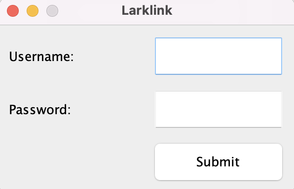

# LarkLink
## Introduction
LarkLink is a chat system that allows you to host a room or join existing rooms to chat with other users.
Once inside the room, you can send and receive normal messages or if you'd like to annoy your friends you can send a _lark_!
## Overview
### Main
Running LarkLink is as simple as navigating to our `Main` class under `src/main/java` and running the `main` method.
It allows you to initialize and start LarkLink.
### Signup and Login
First you'll be prompted to either create an account or sign in to an existing one. 
 
Here, you can create an account or login by entering username and password and click **Submit** button. 
LarkLink allows alphanumeric characters for username and password. Username must be at least 3 characters long and
must not overlap with existing usernames. Password must be at least 8 characters long. 
If you try to set username and password shorter than each minimum length, you will see an error message.
If you enter valid username and password, you're all set! You'll be allowed to either Join or Host a chat room.
### Host a Room
 
To host a room, you need to enter room name with alphanumeric characters and click **Host** button. 
Room name must be at least 5 characters long and if you try to set the room name shorter than the minimum length, you will see an error message. 
In addition, you are allowed to host only one room. 
### Join a Room
 
When you click **Join** button on host or join screen, you'll be prompted to enter the name of room that you try to join. 
If you enter the room name which does not exist or which is invalid, an error message will be shown.
### Send Messages (and _lark_)
### Leave a Room
## Design Patterns
TODO - Mention View Builder Pattern and ??? 

## Test Coverage
TODO - Aim for 100% and justify what we miss

## Java Doc
TODO

## Packaging
TODO - short explanation that it's by use case unless it's low level ?
