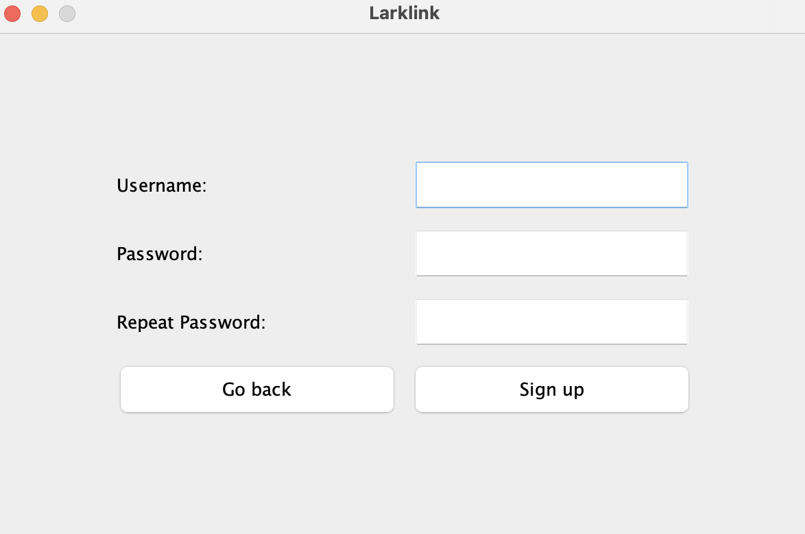

# LarkLink
## Introduction
LarkLink is a chat system that allows you to host a room or join existing rooms to chat with other users.
Once inside the room, you can send and receive normal messages or if you'd like to annoy your friends you can send a _lark_!
## Overview
### Main
Running LarkLink is as simple as navigating to our `Main` class under `src/main/java` and running the `main` method.
It allows you to initialize and start LarkLink. To chat, run two instances, with one hosting the room and the other one joining that room.
### Signup and Login
First you'll be prompted to either create an account or sign in to an existing one. 
 
Clicking the "Log in" button triggers the following 
prompt
 
where the user can enter in existing credentials. Clicking the 
"Sign up" button displays the following.

 

Here, you can create an account by entering username and password and click `Sign up` button. 
LarkLink allows alphanumeric characters for username and password. Username must be at least 3 characters long and
must not overlap with existing usernames. Password must be at least 8 characters long. 
If you try to set username and password shorter than each minimum length, you will see an error message.
If you enter valid username and password, you're all set! You'll be allowed to either Join or Host a chat room.
### Host a Room
 
To host a room, you need to enter room name with alphanumeric characters and click `Host` button. 
Room name must be at least 5 characters long and if you try to set the room name shorter than the minimum length, you will see an error message. 
In addition, you are allowed to host only one room. 
### Join a Room
 
When you click `Join` button on host or join screen, you'll be prompted to enter the name of room that you try to join. 
If you enter the room name which does not exist, an error message will be shown.
### Send Messages (and _lark_)
 
Here you can send a message by typing a message in the blank space and pressing `Send Message`. 
If you try to send an empty message, you will get an error message.
(The implementation of sending lark is still in progress.)

### Leave a Room
If you click `Leave Room` on chat room screen, you can leave the room and you'll be prompted to host or join screen again.
## Clean Architecture
Separation of Concerns: 
The interactor is part of the application core, and it is responsible for handling the business logic related to corresponding use case. 
It communicates with the outer layers (controller, presenter and database_and_drivers) through interfaces (InputBoundary, OutputBoundary, and DBGateway), 
ensuring a clear separation of concerns between different layers of the application.
The Interactor does not have any direct dependencies on specific frameworks or libraries. 
Its dependencies are abstracted through interfaces, and the actual implementations are provided externally (injected) during runtime. 
This design ensures that the core business logic remains agnostic of the technologies used in the outer layers.
In addition, inputs from users and data from DB are encapsulated as input models and DB models to decouple the layers. 
## Solid Principle
**Single Responsibility Principle (SRP)**: All classes and interfaces appears to have a single responsibility, 
which is to handle the interaction between layers for feature related operations. 

**Open/Closed Principle (OCP)**: The Interactor class seems to be open for extension, 
as it is designed to interact with abstractions (InputBoundary and OutputBoundary) rather than concrete implementations. 
This allows for potential extensions or modifications to the behavior of the interactor without modifying its existing code.

**Interface Segregation Principle (ISP)**: Since we aimed to break down the classes into small pieces according to SRP, all interfaces are 
specific to each class which each interface is implemented. 

**Liskov Substitution Principle (LSP)**: All subclasses that inherit superclass `View` are overriding the abstract method `prepareGUI`
and all classes that implement interfaces implemented all methods in corresponding interfaces appropriately. Therefore, all these classes
can be used interchangeably with `View` or each corresponding interface without unexpected error.

**Dependency Inversion Principle (DIP)**: By using interfaces and data transfer object(which is called models here), dependencies between 
layers could be inverted and therefore, high level classes does not directly depend on lower level classes. 
For example, `UserInteractor` can receive data from users through `UserModel` object and `UserInputBoundary` and interact with 
database_and_drivers through `UserDBGateway`. Hence, `UserInteractor` does not depend on outer layers such as controller and database_and_drivers.
This inversion of dependencies allows for easier interacting between layers without affecting core business logic in high level.

## Design Patterns
TODO - Singleton pattern

## Test Coverage
We aimed for near perfect coverage across the board and manage to achieve XX% class coverage and XX% line coverage.  
In the database_and_drivers package we achieved 83% class coverage and 64% line coverage because the HttpClient is impractical to test, 
as we'd have to simulate a server. Otherwise, we tested the core functionality of the DBAccess's in the package.

## Java Doc
TODO

## Packaging
Entity:  `src/main/java/entities` 

Use case:  `src/main/java/host_room` 
<hspace>`src/main/java/join_room` 
`src/main/java/leave_room` 
`src/main/java/messaging` 
`src/main/java/sinup_and_login` 

Input and data model:  `src/main/java/models` 

Gateway and DBAccess:  `src/main/java/database_and_drivers` 

View:  `src/main/java/views` 

